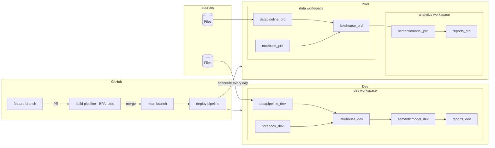

This repository demonstrates a CICD scenario using [Fabric CLI](https://github.com/microsoft/fabric-cli) and GitHub workflows focused for Power BI semantic models and reports.

# Instructions

## Run with GitHub actions

- Fork this repo.
- Configure required [Github secrets and variables](#secrets-and-variables)
- Run the [deploy](/.github/workflows/deploy.yml) Github workflow.

## Run scripts locally

Make sure you have the [Fabric CLI](https://github.com/microsoft/fabric-cli) installed. If not, run:
```bash
$ pip install dist/fabric_cli-0.1.8-py3-none-any.whl --force-reinstall
```

## Secrets and variables

Before running the Github Action, ensure you configure the following [GitHub action secrets and variables](https://docs.github.com/en/actions/security-for-github-actions/security-guides/using-secrets-in-github-actions)

| Name            | Type   | Value                |
|-----------------|--------|----------------------|
| `FABRIC_CLIENT_ID`       | Secret | [Service Principal](https://learn.microsoft.com/en-us/entra/identity-platform/howto-create-service-principal-portal) client ID from your tenant   |
| `FABRIC_CLIENT_SECRET`   | Secret | Service Principal secret |
| `FABRIC_TENANT_ID` | Secret | Your tenant ID |
| `FABRIC_ADMIN_UPNS` | Variable | User [Entra object ID](https://learn.microsoft.com/en-us/partner-center/account-settings/find-ids-and-domain-names#find-the-user-object-id) that will be assigned to the items created by the service principal |
| `FABRIC_CAPACITY` | Variable | Your [Fabric Capacity](https://learn.microsoft.com/en-us/fabric/admin/capacity-settings?tabs=power-bi-premium) name, required to deploy Fabric items such as data pipelines |

## Topology

